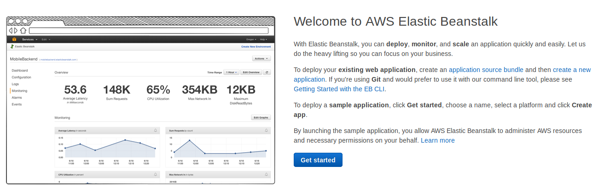
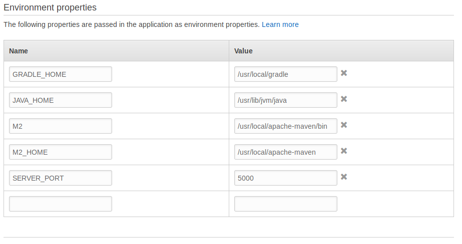

# Fazendo deploys no Elastic BeanStalk

Antes de iniciar, crie um *bucket* e faça upload da aplicação para o S3. É bem simples e você pode usar as 
configurações padrão do serviço.

Após, siga os passos abaixo:

1.  Siga o `get started` na página inicial do serviço;

2. Informe o nome da sua app, selecione a plataforma (por ser um jar executável, a plataforma escolhida deve ser
Java) e informe que irá fazer upload do seu código;

3. Informe o link para o jar que está no armazenamento S3 e continue para configurar mais opções;

4. Na seção *software* insira a variável de ambiente **SERVER_PORT** com o valor 5000 (Porta padrão para as 
aplicações web no Bean Stalk);

5. Na seção *instances*, selecione o grupo de segurança criado no exercício anterior;

6. Na seção *Security* selecione o par de chaves criado no exercío anterior;

7. Proceda com a criação da aplicação.

